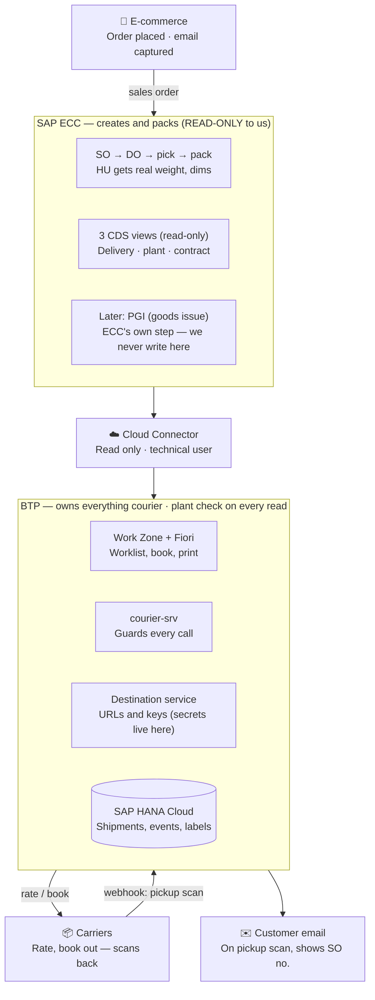

# Courier — End-to-End Process & System Architecture

> **CONFIDENTIAL — INTERNAL USE ONLY.** Contains proprietary information. Do not distribute externally.
>
> **For the AI agent:** This is the visual/narrative overview of the whole flow and the system landscape. Read it right after `07-Courier-PRD.md` to get the big picture before diving into the technical docs. It restates, in richer form, the one-line canonical flow in `00-INDEX.md`.

Source: *"Order → Ship → Invoice: the ten-step flow"* and *"System architecture — ECC creates, BTP ships"* (Gallagher, E-commerce Fulfilment · One-time customer).

Ownership legend used below: **SAP/Warehouse** · **Our App (BTP)** · **Carrier** · **Customer/Finance**.

---

## Part 1 — Order → Ship → Invoice: the ten-step flow

| # | Step | Owner | What happens |
|---|------|-------|--------------|
| 01 | **Order arrives** | SAP | Customer buys online; e-commerce sends the order to SAP → creates the **SO**. Email is **always captured** (mandatory at checkout). One-time customer — a unique address per transaction. |
| 02 | **Pick & pack** | SAP | SAP creates the delivery (**DO**); staff pick the goods. Packed into boxes → SAP creates **handling units (HU)**. Real weight & dimensions are recorded on the HU. |
| 03 | **Delivery appears** | Our App | App reads SAP: shows deliveries picked ✓ packed ✓ **not yet shipped**. Staff see **only their own plant's** deliveries. Shows order #, customer, address, weight, box count. |
| 04 | **Get a price** | App ↔ Carrier | Ask the carrier: *"cost to send this box to this address?"* Uses the **real packed weight** + our contract number → negotiated price. Carrier replies with service options, price, delivery days. |
| 05 | **Book it** ⚠️ **SPENDS MONEY** | Our App → Carrier | Staff (or a rule) picks a service; app tells the carrier "book it". Carrier returns tracking # + label; app saves to HANA. **Scope-protected — once per delivery only** (idempotent). |
| 06 | **Print the label** | Our App | Label returns to the browser → **BrowserPrint → Zebra printer**. Sticker goes on the box. **Reprint is free & unlimited (never re-book).** |
| 07 | **Ship it** | SAP | Staff does **PGI** in SAP (goods issue). Box goes to the dock. Courier collects. |
| 08 | **Courier scans it** | Carrier → App | Courier scans the box at pickup. Carrier fires a **webhook** — "we've got it". Our app receives it, **verifies the signature**, saves it. |
| 09 | **Customer email** | Customer | Triggered by the **pickup scan — not by booking**. Shows the **SO #** (what they know), tracking # + link. **Never the DO #.** **One email per order**, even if 3 boxes. |
| 10 | **Invoice arrives** | Finance | Carrier bills weekly/monthly — **only for boxes actually scanned**. Price may differ (reweigh, dim weight, surcharges, fuel). Compare quoted vs billed → variance report; finance codes it. |

### Two invariants that must never break

1. **Money is spent exactly once (Step 05).** Booking is scope-protected and **idempotent per delivery**. Reprints (Step 06) are free, so staff never re-book.
2. **The customer only hears "shipped" after the pickup scan (Step 08 → 09)** — never while the box is still on the dock. Quote vs. billed is reconciled at Step 10.

---

## Part 2 — System architecture: ECC creates, BTP ships

**SAP ECC creates and packs; BTP owns everything courier.** ECC is **read-only** to us — we never write there.

**Layer notes**

- **E-commerce** — order placed, email captured.
- **SAP ECC** — `SO → DO → pick → pack` (HU gets real weight/dims); exposes **3 read-only CDS views** (delivery · plant · contract); does its own **PGI** later. We never write to ECC.
- **Cloud Connector** — read-only, technical user.
- **BTP (owns everything courier):**
  - **Work Zone + Fiori** — worklist, book, print
  - **courier-srv** — guards every call
  - **Destination service** — URLs and keys (all carrier secrets live here, married to their URLs)
  - **SAP HANA Cloud** — shipments, events, labels
  - **Plant check on every read** — worklist, lookup, dashboard, label
- **Carriers** — rate, book out, scan back (webhook).
- **Customer email** — sent on the pickup scan, shows the SO number.

---

## Abbreviations

| | |
|---|---|
| **SO** | Sales Order |
| **DO** | Delivery Order |
| **HU** | Handling Unit |
| **PGI** | Post Goods Issue |
| **CDS** | Core Data Services |
| **BTP** | SAP Business Technology Platform |
